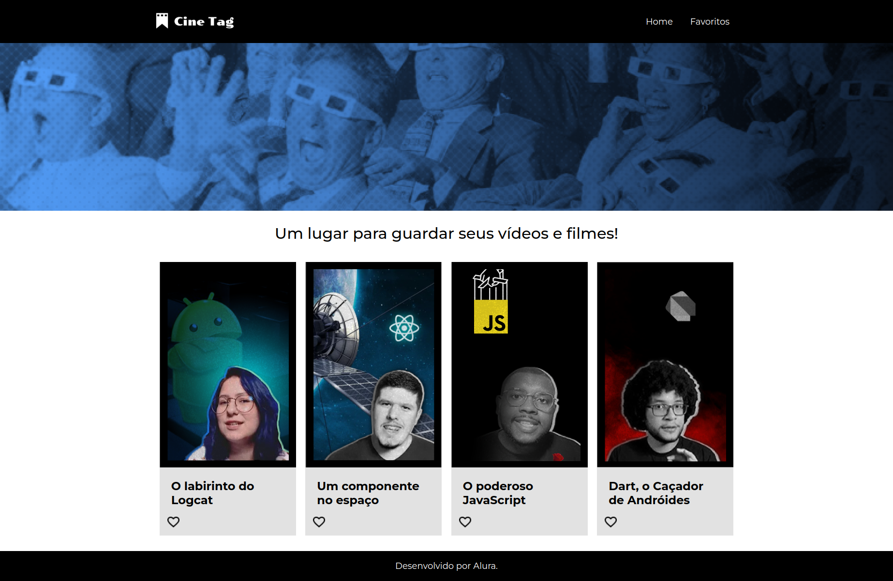

# Cine Tag

Projeto desenvolvido durante o curso React: praticando React com js.

## Link do Vercel
Para acessar a página no vercel [clique aqui](https://cine-tag-rouge.vercel.app/)

## Instalação
Use o comando `npm install` no terminal para instalar as dependências

## Inicialização
Use o comando `npm start` para inicializar o projeto
